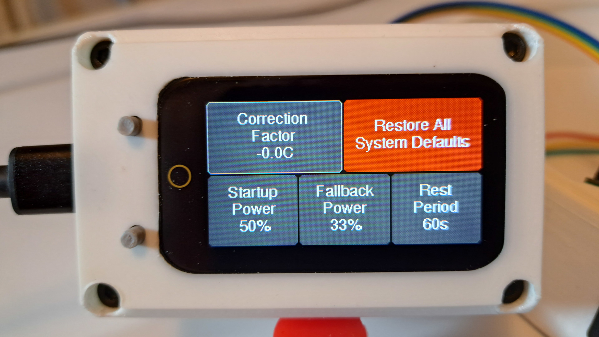

# Calibration

 

Calibrating the correction factor of the Airhead temperature sensor is actually stupid-simple and only requires you to know your altitude above sea level. Water boils at 100C/212F at sea level and that temperature drops by 0.5C/1F for every 500 feet you are above sea level.
