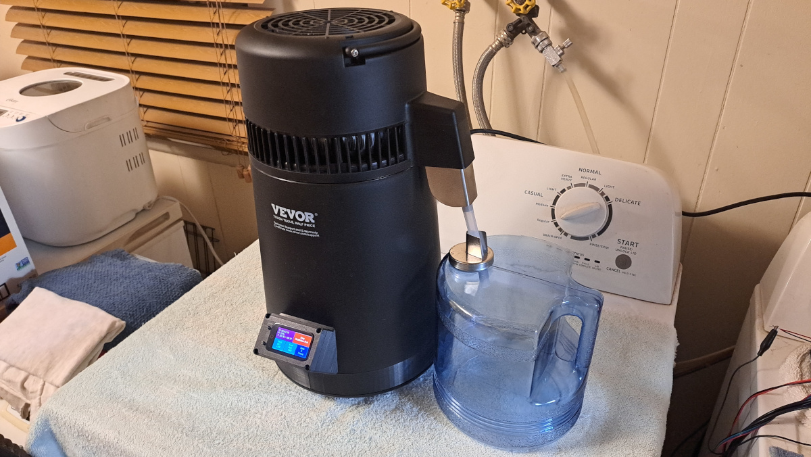

# Airhead Operation

 

As you have probably noticed by the photos on the front page of this GitHub repo, the Airhead has three operating modes. Each of the modes are user configurable and your last used settings will be restored each time you start up your still. In temperature managed modes 2 and 3, the temperature is checked every 30 seconds and the power is adjusted accordingly. The temperature is managed to +/- 0.2C/0.36F in order to maintain a decent level of precision without beating the CPU to death. 

**Mode 1** maintains a constant power level with no temperature management whatsoever. You may adjust the power level from 10% to 100%. Both SCRs and SSRs behave unpredictably below 10% power, so this lower limit is intentionally imposed. This mode would be used for simmering liquids, calibrating the CorrectionFactor variable, or distilling water if you set the power level to 100%. There is a safety feature that will shut down your still if you boil out all of the water. This safety feature kicks in at 103C/217F.

**Mode 2** maintains a constant temperature and automatically adjusts the power. If you fill your still with room temperature solution and you set the temperature to 80C/176F, it may take 30 minutes at sea level to reach the minimum operating temperature. The power level starts out at 50% and progressively increases by 1% every minute until the target temperature is reached. At that point, the power will fall back to one third (33%) and rest for 1 minute before temperature management begins.

**Mode 3** is a timed distillation run where you set a starting and ending temperature. The time is selected in hours and the target temperature is adjusted _(up or down)_ every 15 minutes. This is primarily for distilling spirits. For example, you would do a 2 hour run starting at 80C/176F and ending at 86C/186F. This is a common method used by those who bought Air Still clones with manual temperature control to squeeze out as much product as possible. This mode frees you from performing manual temperature changes.

_**NOTE:** If you are at a higher altitude, such as the "Mile High City" (Denver, CO) you will notice that water boils way faster. After your Airhead performs the 33% fallback when the minimum operating temperature is reached, you will likely see the power level adjust down instead of up. It should come as no surprise to see it adjust down to 18% to 20% to maintain water at 80C/176F, this is absolutely normal._
