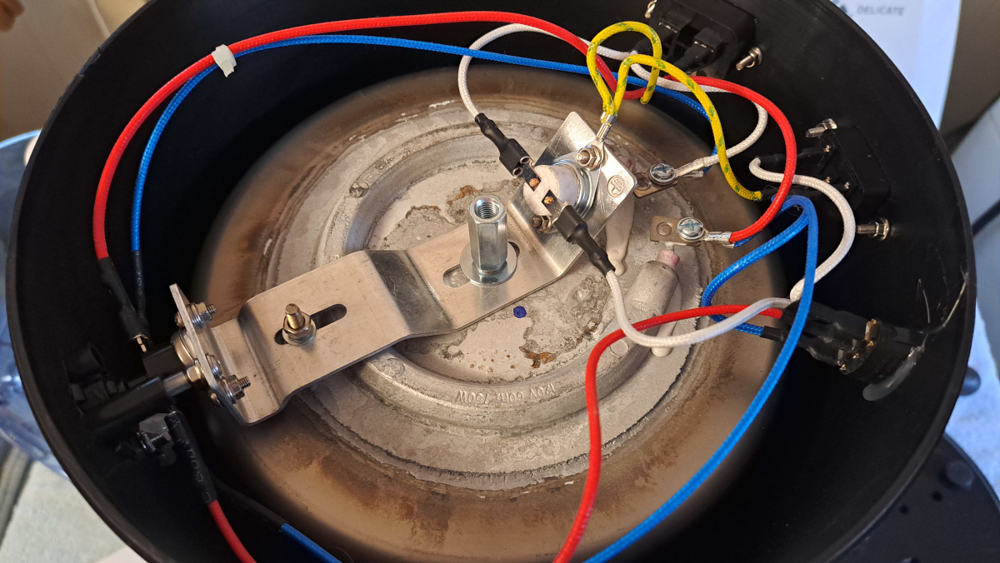
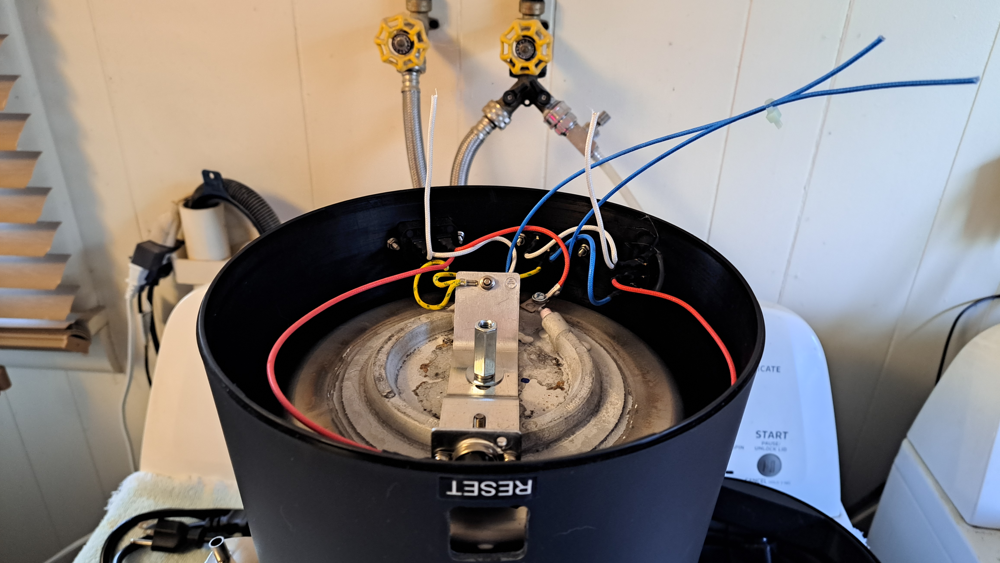
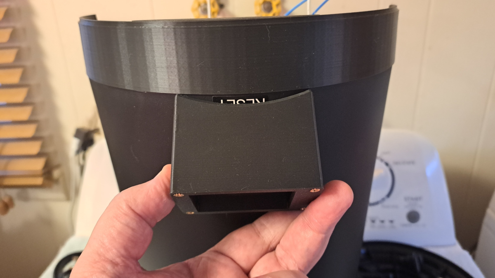
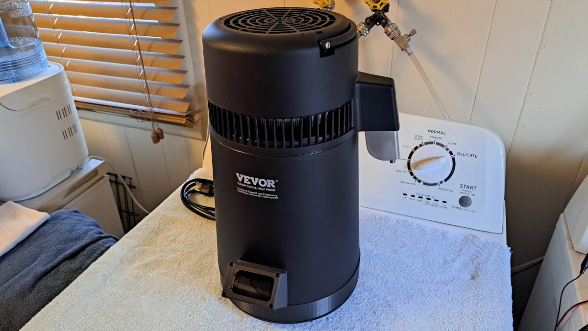

# Instructions

In these examples, I'm using a cheap $65 [Vevor water distiller](https://www.amazon.com/dp/B0CN2SBJLT). No need for an expensive original Air Still for this project. For the sake of simplicity, I will be setting up this Air Still clone to use a solid state relay rather than an SCR controller. So, the first step is to turn your Air Still upside down and remove the bottom cover.

Referring to the photo **Air-Still-Default-Wiring.jpg** here. The white wires are connected to the thermal control snap switch and are the AC neutral connection to the heating element. The blue wires are for an LED power indicator on the front of the still. The red wires are from the AC hot side and go to a circuit breaker on the front of the still and then come back to connect to the other side of the heating element. Lastly, the yellow wires are the earth ground of the AC connection and connect to the body of the boiler vessel.

 

You will now need to remove that aluminum bracket so you can remove the power indicator, the button for the reset breaker, and the snap switch that currently controls the temperature. We will not be removing the reset breaker, but it will likely never be used since the Airhead brain will shut down the unit if it ever goes over 103C/217F. You can clip the wires to the power indicator and strip them back since they will be used to power the Airhead controller system. The wires to the snap switch will be connected to the solid state relay.

 

As you can see in the photo **Air-Still-Lobotomized.jpg** above, everything that I mentioned has been removed and the aluminum bracket has been put back in place. I slid it back as far as it would go since the reset breaker will likely never need to be used unless something goes seriously wrong. We have the blue wires that will be connected to the Airhead power supply and interface board, and the white wires which will be connected to the load side of the solid state relay. You may or may not need to extend the white wires.

_**NOTE:** Depending on your Air Still (or clone) model, the manufacturer may have put the fan on the switched side of the heating element. This is an absolutely stupid plan, the fan should run continuously. The temperature control should only run the heating element. This will require a simple wiring modification if yours has this problem. Lucky me, this unit actually has that exact design flaw._

 

As demonstrated in the photo **Airhead-Case-Back-Fitting.jpg** above, you need to align the back part of your Airhead case over the hole that the reset button was removed from. It's best if you set your spacer ring in place to get your vertical alignment correct. You should mark the two screw holes using a pencil, or small paint brush and paint, or nail polish if you happen to have that at home. Carefully drill the holes while avoiding damage to the boiler vessel inside. Then attach the case with nuts and bolts, paint the threads to lock the nuts in place.

 

As you can see in the photo **Airhead-Brain-Installed.jpg** above, the Airhead brain is installed in its case and it doesn't interfere with the seating of the spacer ring. This is just a dry fitting test before we procede with the wiring. Please keep in mind that the wiring steps that follow are using a prototype power supply and interface board. The Airhead kits that I will be selling on my website will come with an actual custom designed printed circuit board. I just don't have them at this time since they have to be ordered from China in bulk.
