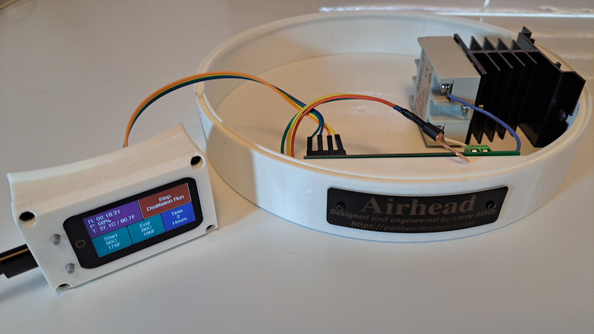
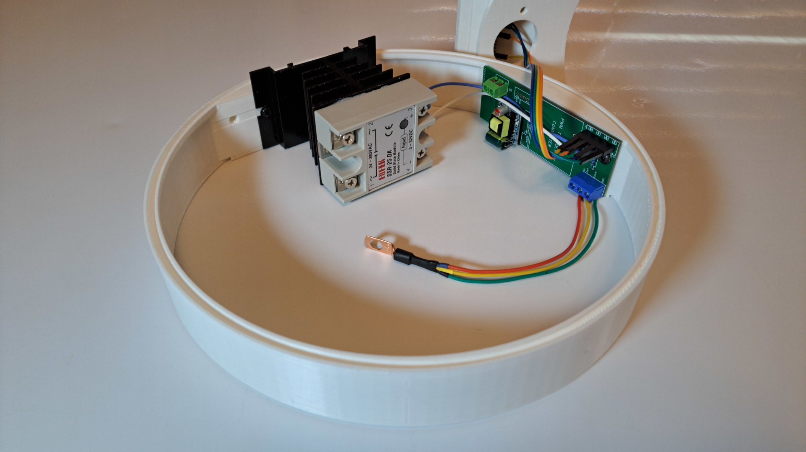
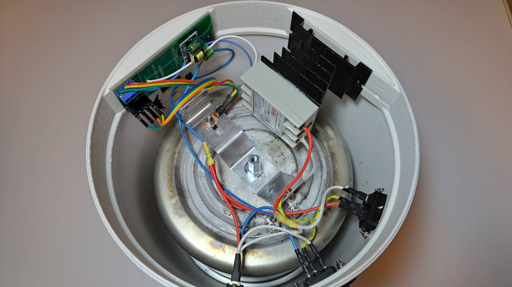
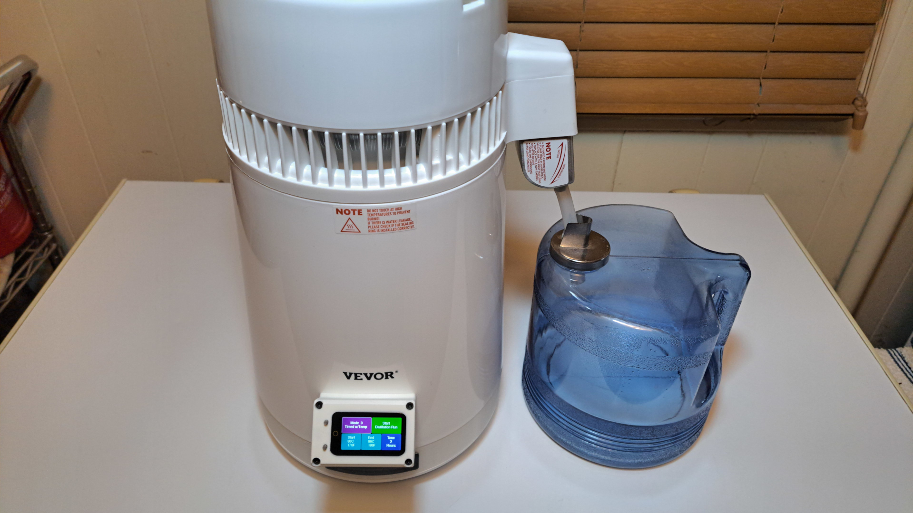

# Installation Guide Video

I have put together the video [Airhead Installation Using a Vevor Air Still](https://youtu.be/vFivj2nX99s) to show people how to install the Airhead Turn-Key Kit in a Vevor water distiller. I also offer people the option to drop-ship their Vevor air still clones to me to have the Airhead installed and tested with an actual run before shipping it out to them. It's only slightly more than the price of the kit alone and saves you the trouble of installing it yourself.

I also put together the video [Airhead + Air Still Full Demo](https://www.youtube.com/watch?v=bEKPDaXU4ro) that shows how to use the Airhead after it's installed. This example shows how to distill wine in order to get high-proof brandy out of it. You can also use the Airhead to make gin and to even clean up whiskey that you may have over-oaked. Just make sure that the overall body of liquid in the still is no more than 40% ABV or things could go BOOM!

# Airhead Turn-Key Kit

For those who aren't up to [component level](https://github.com/larry-athey/airhead/tree/main/Instructions/DIY-Build) electronics work or 3D printing, [Airhead turn-key kits](https://panhandleponics.com/technology-assisted-distillation/) are available from my website for $140 plus shipping in the USA where the USPS flat-rate box coverage area applies. Orders to Alaska and Hawaii require a special URL to be emailed to you due to the added shipping expense.

Please keep in mind that I'm not running a full blown mail-order operation. I only have four 3D printers and only one that is large enough to print the Airhead spacer ring. Each of these kits take 12 hours to print all parts, so I'm only capable of building and testing one Airhead every 3 days. My other three printers are pretty much dedicated to printing [Boilermaker](https://github.com/larry-athey/boilermaker) cases which I can also only build and test one every 3 days.

 

 

 

 

 
